<div align="center">



<p>
  <a href="https://github.com/arielwijayasaputra">
    
  </a>
  <a href="mailto:arielwijayasaputra9@gmail.com">
    
  </a>
  <a href="https://www.linkedin.com/in/ariel-wijaya-saputra-9a06623a0/">
    
  </a>
  <a href="https://instagram.com/ariel_wijaya1789">
    
  </a>
  <a href="https://maps.google.com/?q=Tulungagung,+Jawa+Timur,+Indonesia">
    
  </a>
</p>


</div>

---

## About Me

```yaml
Name       : "Ariel Wijaya Saputra"
Birthdate  : "17 August 2009"
Role       : "Frontend & Backend Dev"
Major      : "Rekayasa Perangkat Lunak (RPL)"
Education  : "SMK Negeri 1 Boyolangu"
Location   : "Tulungagung, Jawa Timur, Indonesia"
Hobbies    : ["Coding", "Gaming", "Listening Music"]
```

> *"Jangan biarkan pencapaian orang lain membuatmu merasa tertinggal. Kita tidak sedang berlomba dengan siapa pun."*
>
> *"Don't let the achievements of others make you feel left behind. We are not in a race with anyone."*

---

## Tech Stack & Skills

<div align="center">

### Frontend
<p>
  
  
  
</p>

### Backend & Frameworks
<p>
  
  
</p>

### Database
<p>
  
  
  
</p>

### Tools & Software
<p>
  
  
  
  
  
</p>

### Operating System
<p>
  
  
</p>

</div>

---

## GitHub Stats

<div align="center">


</div>

---

## Goals 2026

```
2026 Goals:
   ✦ Meningkatkan kemampuan Frontend Development (React, Tailwind)
   ✦ Memperdalam skill Backend (Node.js, REST API, Database)
   ✦ Membangun proyek portofolio pertama yang siap ditampilkan
   ✦ Memahami konsep Full Stack Development secara menyeluruh
   ✦ Mulai berkontribusi ke komunitas open source
   ✦ Konsisten coding setiap hari
```

---

## Currently Learning

```
Saat ini sedang mempelajari:
   - Pengembangan Web Berbasis Laravel (PHP Framework)
   - Arsitektur MVC dalam Laravel
   - Autentikasi & manajemen session dengan Laravel
   - Integrasi database menggunakan Eloquent ORM
   - RESTful API menggunakan Laravel
```


## Contribution Activity

<div align="center">


</div>

---

## Quote

<div align="center">


</div>

---

## Let's Connect

<div align="center">
<p>
  <a href="mailto:arielwijayasaputra9@gmail.com">
    
  </a>
  <a href="https://www.linkedin.com/in/ariel-wijaya-saputra-9a06623a0/">
    
  </a>
  <a href="https://instagram.com/ariel_wijaya1789">
    
  </a>
</p>
</div>

---

<div align="center">

</div>
